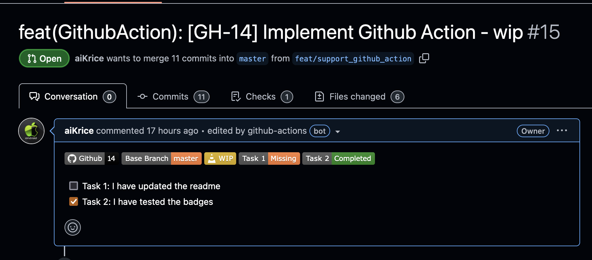

<h1 align="center">
    
    <br/>
    Badgetizr


[](https://github.com/marketplace/actions/badgetizr)
[](https://gitlab.com/chris-saez/badgetizr-integration)
</h1>

<h2 align="center">
    Add badges to your pull requests and increase your productivity 🚀.
</h2>

<div id="header" align="center">
  
</div>

---

## Table of Contents

- [What is Badgetizr?](#what-is-badgetizr)
- [Multi-Platform Support](#multi-platform-support)
- [Installation](#installation)
  - [Homebrew (macOS)](#homebrew-macos)
  - [GitHub Actions](#github-actions)
  - [GitLab CI](#gitlab-ci)
  - [Manual Installation](#manual-installation)
- [Usage](#usage)
  - [Command Line Options](#command-line-options)
  - [Basic Examples](#basic-examples)
  - [Provider Detection](#provider-detection)
- [Configuration](#configuration)
- [Badges](#badges)
- [Contributing](#contributing)
- [Publishing (for maintainers)](#publishing-for-maintainers)
- [Troubleshooting](#troubleshooting)

---

## What is Badgetizr?

Badgetizr automatically adds customizable badges to your GitHub and GitLab pull/merge requests to boost team productivity. With support for multiple badge types and full CI/CD integration, it helps teams:

- 🎯 **Track ticket references** automatically from PR titles
- ⚠️ **Identify work-in-progress** pull requests clearly
- 📊 **Monitor CI/CD status** without clicking through pipelines
- ✅ **Visualize completion status** of checklists and tasks
- 🎯 **Highlight target branches** for better merge awareness

## Multi-Platform Support

✅ **GitHub** - Full support via GitHub CLI
✅ **GitLab** - Full support via GitLab CLI
✅ **GitHub Actions** - Native integration
✅ **GitLab CI** - Native integration

## Installation

### Homebrew (macOS)

```bash
# Add the tap and install
brew tap aiKrice/badgetizr
brew install aiKrice/badgetizr/badgetizr

# Configure authentication
export GITHUB_TOKEN="your_github_token"     # For GitHub
export GITLAB_TOKEN="your_gitlab_token"     # For GitLab
```

### GitHub Actions

Add this to your workflow (`.github/workflows/*.yml`):

```yaml
jobs:
  badgetizr:
    runs-on: ubuntu-latest
    steps:
      - name: Checkout
        uses: actions/checkout@v3

      - name: Run Badgetizr
        uses: aiKrice/homebrew-badgetizr@1.6.1
        with:
          pr_id: ${{ github.event.pull_request.number }}
          configuration: .badgetizr.yml
          pr_destination_branch: ${{ github.event.pull_request.base.ref }}
          pr_build_number: ${{ github.run_id }}
          pr_build_url: "https://github.com/${{ github.repository }}/actions/runs/${{ github.run_id }}"
        env:
          GH_TOKEN: ${{ secrets.GITHUB_TOKEN }}
```

### GitLab CI

Add this to your `.gitlab-ci.yml`:

```yaml
badgetizr:
  stage: build
  image: alpine:latest
  before_script:
    - apk add --no-cache curl bash yq jq
    - curl -sSL "https://gitlab.com/gitlab-org/cli/-/releases/v1.71.1/downloads/glab_1.71.1_linux_amd64.tar.gz" | tar -xz -C /tmp
    - mv /tmp/bin/glab /usr/local/bin/glab && chmod +x /usr/local/bin/glab
    - curl -sSL https://github.com/aiKrice/homebrew-badgetizr/archive/refs/tags/1.6.1.tar.gz | tar -xz
    - cd homebrew-badgetizr-*
  script:
    - |
      ./badgetizr -c .badgetizr.yml \
      --pr-id=$CI_MERGE_REQUEST_IID \
      --pr-destination-branch=$CI_MERGE_REQUEST_TARGET_BRANCH_NAME \
      --pr-build-number=$CI_PIPELINE_ID \
      --pr-build-url=https://gitlab.com/$CI_PROJECT_PATH/-/jobs/$CI_PIPELINE_ID \
      --provider=gitlab
  rules:
    - if: $CI_PIPELINE_SOURCE == "merge_request_event"
  variables:
    GITLAB_TOKEN: $GITLAB_ACCESS_TOKEN
```

### Manual Installation

```bash
# Download latest release
curl -sSL https://github.com/aiKrice/homebrew-badgetizr/releases/latest/download/badgetizr.tar.gz | tar -xz --strip-components=1

# Install dependencies (yq, jq) - supports macOS and Linux only
./configure

# Install platform-specific CLI tools
# For GitHub:
brew install gh                    # macOS/Linux

# For GitLab:
# Download from: https://gitlab.com/gitlab-org/cli/-/releases

# Configure authentication
export GITHUB_TOKEN="your_github_token"     # For GitHub
export GITLAB_TOKEN="your_gitlab_token"     # For GitLab
```

## Usage

### Command Line Options

```bash
badgetizr [options]
```

#### Required Options

| Option | Description |
|--------|-------------|
| `--pr-id <id>` | Specify the pull/merge request ID |

#### Optional Options

| Option | Description | Default |
|--------|-------------|---------|
| `-c <file>`, `--configuration <file>` | Path to configuration file | `.badgetizr.yml` |
| `--pr-destination-branch <branch>` | Target branch (required for branch badge) | - |
| `--pr-build-number <number>` | Build number (required for CI badge) | - |
| `--pr-build-url <url>` | Build URL (required for CI badge) | - |
| `--provider <provider>` | Force provider (`github` or `gitlab`) | Auto-detected |
| `-v`, `--version` | Display version | - |
| `-h`, `--help` | Display help | - |

### Basic Examples

```bash
# Minimal usage (auto-detects GitHub/GitLab)
badgetizr --pr-id=123

# With custom configuration
badgetizr -c custom.yml --pr-id=123

# Force specific provider
badgetizr --provider=gitlab --pr-id=123

# Complete example with all options
badgetizr \
  --pr-id=123 \
  --pr-destination-branch=main \
  --pr-build-number=456 \
  --pr-build-url="https://github.com/owner/repo/actions/runs/456" \
  --provider=github
```

### Provider Detection

Badgetizr automatically detects your platform:

- **GitHub**: Uses `gh` CLI with `GITHUB_TOKEN` or `GH_TOKEN`
- **GitLab**: Uses `glab` CLI with `GITLAB_TOKEN`
- **Auto-detection**: Based on `git remote get-url origin`
- **Manual override**: Use `--provider=github` or `--provider=gitlab`

## Configuration

Badgetizr uses a YAML configuration file to define which badges to display and their settings.

### Configuration File

- **Default location**: `.badgetizr.yml` in your project root
- **Custom location**: Use `-c path/to/config.yml`
- **Example file**: See `.badgetizr.yml.example` in the repository

```bash
# Use default configuration
badgetizr --pr-id=123

# Use custom configuration
badgetizr -c my-config.yml --pr-id=123
```

## Badges

Badgetizr supports multiple badge types that can be customized to track different aspects of your pull requests.

📖 **[Complete Badge Documentation](BADGES.md)**

### Quick Overview

| Badge Type | Default Status | Purpose | Preview |
|-----------|----------------|---------|---------|
| 🎫 **Ticket** | Disabled | Links to ticket systems (Jira, GitHub Issues, etc.) |  |
| ⚠️ **WIP** | Enabled | Identifies work-in-progress pull requests |  |
| 📊 **Dynamic** | Disabled | Tracks checklist completion and custom patterns |  |
| 🌿 **Branch** | Disabled | Highlights non-standard target branches |  |
| 🚀 **CI** | Disabled | Shows build information with links to CI runs |  |

### Configuration

Badgetizr uses a YAML configuration file to define badge settings:

- **Default location**: `.badgetizr.yml` in your project root
- **Custom location**: Use `-c path/to/config.yml`
- **Icons**: All badges support icons from [Simple Icons](https://simpleicons.org/)

## Contributing

We welcome contributions to Badgetizr! Whether you're fixing bugs, adding features, or improving documentation, your help is appreciated.

🤝 **[Complete Contributing Guide](CONTRIBUTING.md)**

### Quick Start

| Step | Action | Command |
|------|--------|---------|
| 1️⃣ **Fork & Clone** | Fork the repository and clone locally | `git clone https://github.com/your-username/homebrew-badgetizr.git` |
| 2️⃣ **Setup** | Install dependencies and configure tokens | `./configure && export GITHUB_TOKEN="..."` |
| 3️⃣ **Test** | Test your changes with real PRs | `./badgetizr --pr-id=123` |
| 4️⃣ **PR Rule** | Run Badgetizr on your own PR | `./badgetizr --pr-id=YOUR_PR_NUMBER` |

### Contributing Areas

- 🐛 **Bug Fixes**: Authentication, badge rendering, configuration parsing
- ✨ **New Features**: Additional badge types, CI/CD platform support
- 📚 **Documentation**: README improvements, troubleshooting guides
- 🧪 **Testing**: Unit tests, integration tests, cross-platform compatibility

## Publishing (for maintainers)

Automated release process for maintainers to publish new versions of Badgetizr.

📦 **[Complete Publishing Guide](PUBLISHING.md)**

### Quick Release

| Step | Action | Command |
|------|--------|---------|
| 1️⃣ **Prerequisites** | Clean develop branch + GitHub token | `git status && export GITHUB_TOKEN="..."` |
| 2️⃣ **Release** | Run automated publish script | `./publish.sh 1.5.6` |
| 3️⃣ **Verify** | Check release and Homebrew formula | `brew install aiKrice/badgetizr/badgetizr` |

### What It Does

- ✅ **Version Updates**: Updates version in all files and documentation
- ✅ **Branch Management**: Handles develop → master → tag → release flow
- ✅ **Homebrew Formula**: Calculates SHA256 and updates formula automatically
- ✅ **Cleanup**: Backmerges to develop and cleans temporary files

## Troubleshooting

Having issues? Check our comprehensive troubleshooting guide.

🔧 **[Complete Troubleshooting Guide](TROUBLESHOOTING.md)**

### Quick Help

**Authentication issues**:
- GitHub: `gh auth login` or set `GITHUB_TOKEN`
- GitLab: `glab auth login` or set `GITLAB_TOKEN`

**No badges showing**: Check configuration file and PR content matches badge criteria

**Command not found**: Install via Homebrew or run `./configure` for dependencies